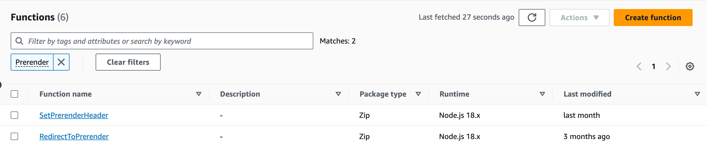
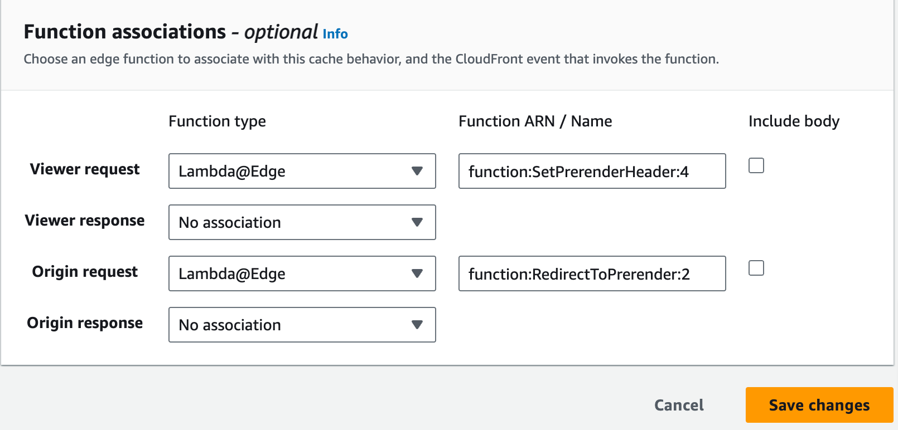

# prerender-io-cloudfront-s3
Optimize SEO for JavaScript websites with Prerender.io. Server-side pre-rendering enhances search engine visibility, accelerates page loads, and ensures accurate social media previews. Compatible with popular frameworks. Elevate your website's SEO performance today!


Develop two Lambda@Edge functions as follows, currently available exclusively in the AWS North Virginia region.

## 1. SetPrerenderHeader

```bash
'use strict'; 
/* change the version number below whenever this code is modified */  
exports.handler = (event, context, callback) => { 
    const request = event.Records[0].cf.request;  
    const headers = request.headers;  
    const user_agent = headers['user-agent']; 
    const host = headers['host']; 
    if (user_agent && host) { 
      var prerender = /googlebot|adsbot\-google|Feedfetcher\-Google|bingbot|yandex|baiduspider|Facebot|facebookexternalhit|twitterbot|rogerbot|SemrushBot|Screaming|linkedinbot|embedly|quora link preview|showyoubot|outbrain|pinterest|slackbot|vkShare|W3C_Validator|redditbot|applebot|whatsapp|flipboard|tumblr|bitlybot|skypeuripreview|nuzzel|discordbot|google page speed|qwantify|pinterestbot|bitrix link preview|xing\-contenttabreceiver|chrome\-lighthouse|telegrambot/i.test(user_agent[0].value); 
      prerender = prerender || /_escaped_fragment_/.test(request.querystring);  
      prerender = prerender && ! /\.(js|css|xml|less|png|jpg|jpeg|gif|pdf|doc|txt|ico|rss|zip|mp3|rar|exe|wmv|doc|avi|ppt|mpg|mpeg|tif|wav|mov|psd|ai|xls|mp4|m4a|swf|dat|dmg|iso|flv|m4v|torrent|ttf|woff|svg|eot)$/i.test(request.uri); 
      if (prerender) {  
        headers['x-prerender-token'] = [{ key: 'X-Prerender-Token', value: <<PrenderToke>>}]; 
        headers['x-prerender-host'] = [{ key: 'X-Prerender-Host', value: host[0].value}]; 
        headers['x-prerender-cachebuster'] = [{ key: 'X-Prerender-Cachebuster', value: Date.now().toString()}]; 
        headers['x-query-string'] = [{ key: 'X-Query-String', value: request.querystring}]; 
      } 
    } 
    callback(null, request);  
}; 
```
*Note: Please make sure to update `PrerenderToken` in code*

This Lambda function acts as an AWS CloudFront function, specifically designed to enable prerendering for specific user agents and requests. It checks for search engine bots or a specific query string parameter and modifies the request headers accordingly, facilitating prerendering for improved search engine optimization.


## 2. RedirectToPrerender

```bash
'use strict'; 
/* change the version number below whenever this code is modified */  
exports.handler = (event, context, callback) => { 
     const request = event.Records[0].cf.request; 
     if (request.headers['x-prerender-token'] && request.headers['x-prerender-host'] && request.headers['x-query-string']) {  
       request.querystring = request.headers['x-query-string'][0].value;  
       request.origin = { 
           custom: {  
               domainName: 'service.prerender.io',  
               port: 443, 
               protocol: 'https', 
               readTimeout: 20, 
               keepaliveTimeout: 5, 
               customHeaders: {}, 
               sslProtocols: ['TLSv1', 'TLSv1.1'],  
               path: '/https%3A%2F%2F' + request.headers['x-prerender-host'][0].value 
           }  
       }; 
    } 
    callback(null, request);  
};  
```
This Lambda function serves as an AWS CloudFront origin request function. It is designed to handle requests before they are sent to the origin server, specifically checking for headers that indicate a prerendering requirement. If these headers are present, the function modifies the request object to update the query string and origin server details, directing the request to a prerendering service. This is commonly used to serve pre-rendered content to web crawlers, enhancing search engine optimization for dynamic web applications.




## 3. Cloudfront Function associations

Proceed to CloudFront, where you've set up your S3 bucket for static web hosting. Navigate to the behavior of the default (if configured for a website) or index.html and modify function associations. In this step, you should map the Lambda ARN of SetPrerenderHeader to the View Request and the Lambda ARN of RedirectToPrerender to the Origin Request. As mentioned earlier, it's crucial that the Lambda@Edge functions are in the North Virginia region of AWS; otherwise, they won't be accessible here.



## 4. Testing
To view the page as rendered by prerender.io, use the following command:

```bash
curl -H 'User-Agent: Facebot' <<any-website-url>>
```

To view the same page without pre-rendering, use:
```bash
curl <<any-website-url>>
```